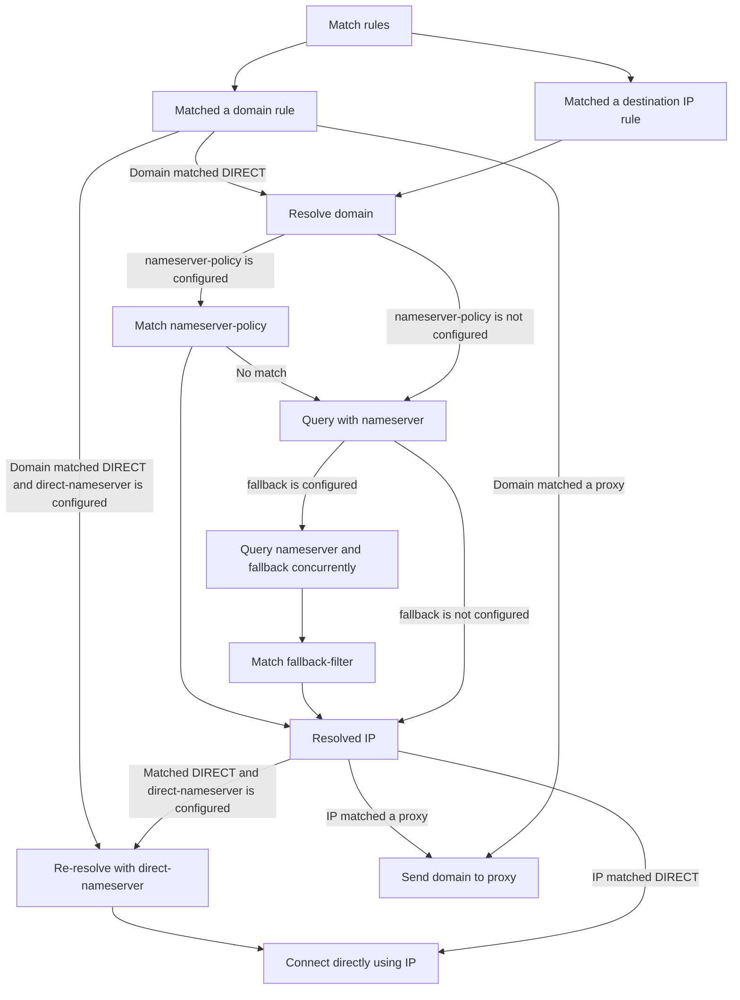

# Resolution Flow

## Example Configuration

```{.yaml linenums="1"}
dns:
  nameserver:
    - https://doh.pub/dns-query
  fallback:
    - https://8.8.8.8/dns-query
  direct-nameserver:
    - system
  nameserver-policy:
    "geosite:cn,private":
    - https://doh.pub/dns-query
    - https://dns.alidns.com/dns-query
  fallback-filter:
    geoip: true
    geoip-code: CN
    geosite:
      - gfw
    ipcidr:
      - 240.0.0.0/4
    domain:
      - '+.google.com'
      - '+.facebook.com'
      - '+.youtube.com'

rules:
- DOMAIN-SUFFIX,google.com,PROXY
- GEOIP,CN,DIRECT
- MATCH,PROXY
```

## Flow

!!! note ""
    This section only describes how the DNS module processes requests.

!!! warning ""
    ~~Re-resolution through `direct-nameserver` only applies to TCP connections.~~
    Since v1.19.10, re-resolution through `direct-nameserver` also applies to UDP connections. For TUN inbounds, this is limited to fake-IP mode.


