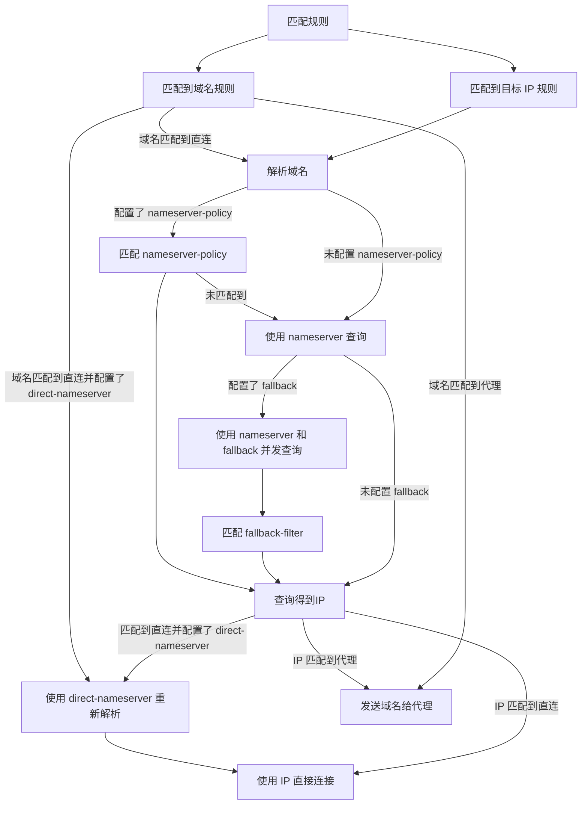

# 解析流程

## 示例配置

```{.yaml linenums="1"}
dns:
  nameserver:
    - https://doh.pub/dns-query
  fallback:
    - https://8.8.8.8/dns-query
  direct-nameserver:
    - system
  nameserver-policy:
    "geosite:cn,private":
    - https://doh.pub/dns-query
    - https://dns.alidns.com/dns-query
  fallback-filter:
    geoip: true
    geoip-code: CN
    geosite:
      - gfw
    ipcidr:
      - 240.0.0.0/4
    domain:
      - '+.google.com'
      - '+.facebook.com'
      - '+.youtube.com'

rules:
- DOMAIN-SUFFIX,google.com,PROXY
- GEOIP,CN,DIRECT
- MATCH,PROXY
```

## 流程

!!! note ""
    此部分仅说明 dns 模块的处理过程

!!! warning ""
    ~~direct-nameserver 重新解析仅限 tcp 连接~~
    direct-nameserver 重新解析在v1.19.10后同样应用于 UDP 连接（对于Tun入站仅限Fakeip模式下）


