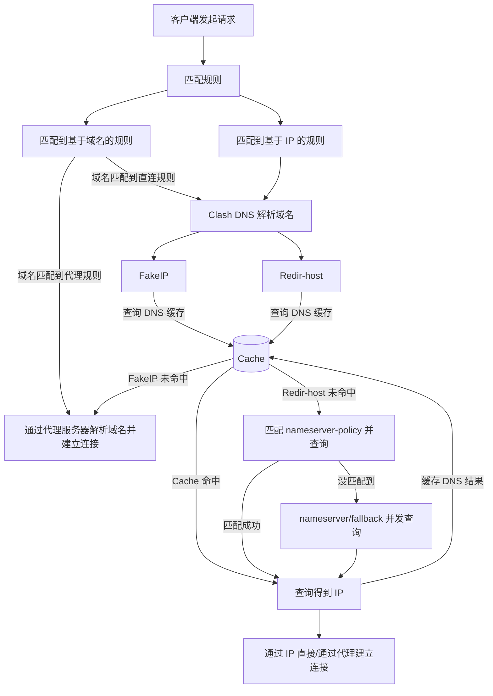

# DNS 流程图

以下流程仅供参考，忽略了Clash内部的DNS映射处理。

```mermaid
flowchart TD
  Start[客户端发起请求] --> rule[匹配规则]
  rule -->  Domain[匹配到基于域名的规则]
  rule --> IP[匹配到基于 IP 的规则]

  Domain --> |域名匹配到直连规则|DNS
  IP --> DNS[Clash DNS 解析域名]

  
  Domain --> |域名匹配到代理规则|Remote[通过代理服务器解析域名并建立连接]

  Cache --> |Redir-host 未命中|NS[匹配 nameserver-policy 并查询 ]
  Cache --> |Cache 命中|Get
  Cache --> |FakeIP 未命中|Remote 

  NS --> |匹配成功| Get[将查询到的 IP 用于匹配 IP 规则]
  NS --> |没匹配到| NF[nameserver/fallback 并发查询]

  NF --> Get[查询得到 IP]
  Get --> |缓存 DNS 结果|Cache[(Cache)]
  Get --> S[通过 IP 直接/通过代理建立连接]

  DNS --> Redir-host 
  DNS --> FakeIP
  FakeIP --> |查询 DNS 缓存|Cache
  Redir-host --> |查询 DNS 缓存| Cache


```
