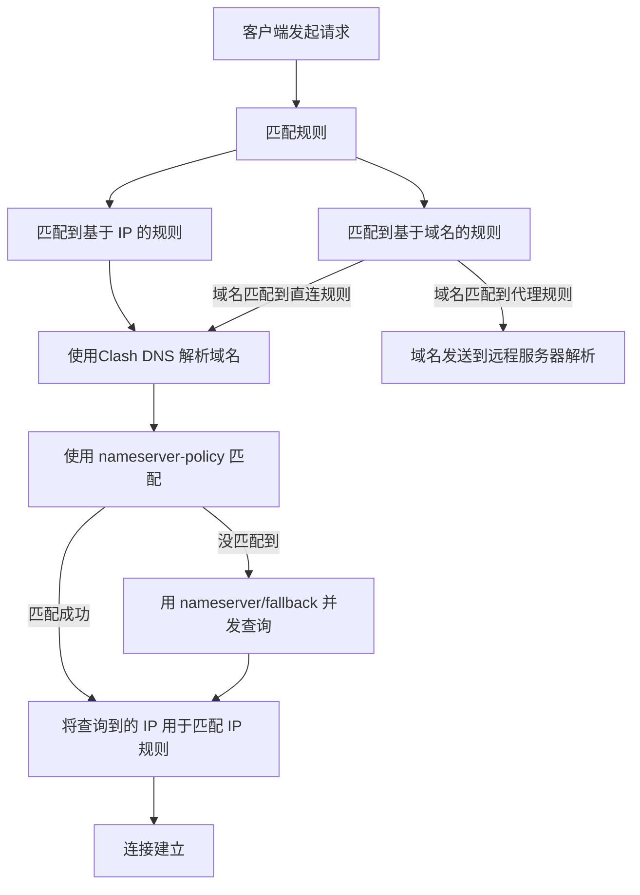

# DNS 流程图

```mermaid
graph TD
  A[客户端发起请求] --> B[匹配规则]
  B --> IP[匹配到基于 IP 的规则]
  B -->  I[匹配到基于域名的规则]
  IP --> DNS[使用Clash DNS 解析域名]
  DNS --> NS[使用 nameserver-policy 匹配]
  NS --> |匹配成功| G[将查询到的 IP 用于匹配 IP 规则]
  NS --> |没匹配到| F[用 nameserver/fallback 并发查询]

  F --> G[将查询到的 IP 用于匹配 IP 规则]
  I --> |域名匹配到直连规则| DNS
  I --> |域名匹配到代理规则|L[域名发送到远程服务器解析]
  G --> S[连接建立]
```

