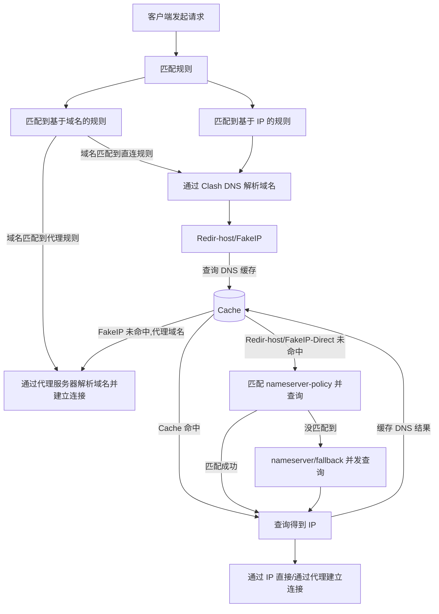

以下是两种常见的 DNS 配置：

```{.yaml linenums="1"}
dns:
  ...
  ipv6: true
  enhanced-mode: redir-host / fake-ip
  fake-ip-range: 28.0.0.1/8
  fake-ip-filter:
    - '*'
    - '+.lan'
  nameserver:
    - https://doh.pub/dns-query
  fallback:
    - https://8.8.8.8/dns-query
  nameserver-policy:
    "geosite:cn,private":
      - https://doh.pub/dns-query
      - https://dns.alidns.com/dns-query
```

此流程图为了更直观和简单地说明 Clash.Meta 的 DNS 工作流程，忽略了 Clash 内部的 DNS 映射处理。


