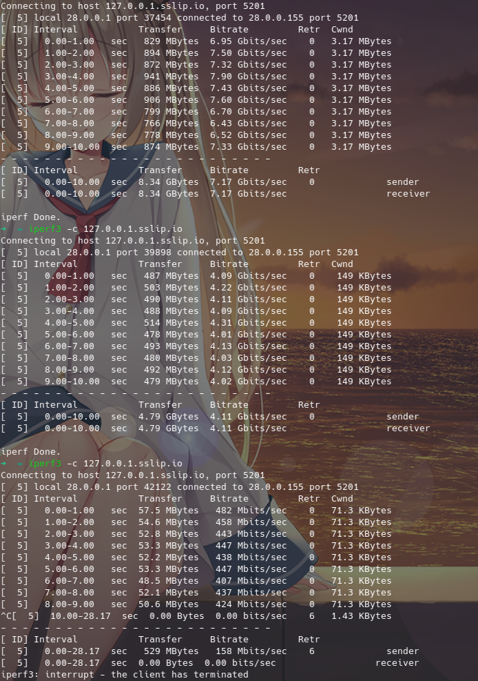

# TUN

```{.yaml linenums="1"}
tun:
  enable: true
  stack: system
  auto-route: true
  auto-redirect: true
  auto-detect-interface: true
  dns-hijack:
    - any:53
    - tcp://any:53
  device: utun0
  mtu: 9000
  strict-route: true
  gso: true
  gso-max-size: 65536
  inet6-address: fdfe:dcba:9876::1/126
  udp-timeout: 300
  iproute2-table-index: 2022
  iproute2-rule-index: 9000
  endpoint-independent-nat: false
  route-address-set:
    - ruleset-1
  route-exclude-address-set:
    - ruleset-2
  route-address:
    - 0.0.0.0/1
    - 128.0.0.0/1
    - "::/1"
    - "8000::/1"
  route-exclude-address:
  - 192.168.0.0/16
  - fc00::/7
  include-interface:
  - eth0
  exclude-interface:
  - eth1
  include-uid:
  - 0
  include-uid-range:
  - 1000:9999
  exclude-uid:
  - 1000
  exclude-uid-range:
  - 1000:9999
  include-android-user:
  - 0
  - 10
  include-package:
  - com.android.chrome
  exclude-package:
  - com.android.captiveportallogin

## Legacy Syntax
  inet4-route-address:
  - 0.0.0.0/1
  - 128.0.0.0/1
  inet6-route-address:
  - "::/1"
  - "8000::/1"
  inet4-route-exclude-address:
  - 192.168.0.0/16
  inet6-route-exclude-address:
  - fc00::/7

```

## enable

Enable TUN mode.

## stack

TUN mode protocol stack. If no usage issues occur, `mixed` stack is recommended. Default is `gvisor`.

Available values: `system/gvisor/mixed`

!!! note "Differences between protocol stacks"
* `system` uses the system protocol stack, providing a more stable/comprehensive TUN experience with relatively lower resource usage compared to other stacks.
* `gvisor` implements the network protocol stack in user space, offering higher security and isolation while avoiding context switching between the OS kernel and user space, which can yield better network processing performance under specific conditions.
* `mixed` is a hybrid stack where TCP uses the `system` stack and UDP uses the `gvisor` stack, potentially delivering a better overall user experience.
* [Simple Performance Test](tun.md%23tun_1)
* If the firewall is turned on, `system` and `mixed` protocol stacks cannot be used. Allow the core binary through the firewall using the following methods:
* Windows: Settings -> Windows Security -> Allow an app through firewall -> Select the core binary.
* MacOS: Generally no configuration is required as the firewall allows signed software by default. If you encounter issues where it cannot be used with the firewall enabled, you can try allowing it: System Settings -> Network -> Firewall -> Options -> Add Mihomo app.
* Linux: Generally no configuration is required as the firewall does not block applications by default. If you encounter issues with the firewall enabled, you can try allowing outbound traffic from the TUN interface (assuming the TUN interface is named Mihomo): `sudo iptables -A OUTPUT -o Mihomo -j ACCEPT`

## device

Specify the name of the TUN network interface. MacOS devices can only use interface names starting with `utun`.

## auto-route

Automatically set global routes, which can automatically route global traffic into the TUN network interface.

## auto-redirect

Linux only. Automatically configures iptables/nftables to redirect TCP connections. Requires `auto-route` to be enabled.

*On Android*:

Only forwards local IPv4 connections. To share your VPN connection via hotspot or tethering, please use [VPNHotspot](https://github.com/Mygod/VPNHotspot).

*On Linux*:

With auto-route enabled, auto-redirect now works on routers as expected without any manual intervention.

## auto-detect-interface

Automatically detect the outbound interface for traffic. It is recommended to manually specify the outbound network interface for devices connected to multiple outbound interfaces simultaneously.

## dns-hijack

DNS hijacking. Redirects matched connections into the internal [DNS](../dns/index.md) module. If no protocol is specified, it defaults to `udp://`.

!!! warning ""
* On `MacOS`/`Windows`, it cannot automatically hijack DNS requests sent to the local network.
* On `Android`, if `Private DNS` is enabled, DNS requests cannot be automatically hijacked.

## strict-route

Enforces strict routing rules when `auto-route` is enabled.

*On Linux*:

* Makes unsupported networks unreachable.
* Routes all connections to the TUN interface.

It prevents address leaks and allows DNS hijacking to work on Android.

*On Windows*:

* Adds firewall rules to block DNS leaks caused by Windows' [normal multi-homed DNS resolution behavior](https://learn.microsoft.com/en-us/previous-versions/windows/it-pro/windows-server-2008-R2-and-2008/dd197552%28v%3Dws.10%29).

It may cause certain applications (such as VirtualBox) to malfunction under specific scenarios.

## mtu

Maximum Transmission Unit. It affects the transfer rate under extreme conditions. General users can leave it at default.

## gso

Enable Generic Segmentation Offload. Linux only.

## gso-max-size

The maximum length of a data chunk.

## inet6-address

Specify the IPv6 address of the TUN interface.

!!! note
* Currently, the program will check other system interfaces for IPv6 upon startup. If none exists, this feature will be disabled. To force enable the v6 address for the TUN interface, please manually set the `SKIP_SYSTEM_IPV6_CHECK=1` system environment variable.
* It requires `ipv6` to be set to `true` in the top-level configuration simultaneously to take effect.

## udp-timeout

UDP NAT expiration time, in seconds. Default is 300 (5 minutes).

## iproute2-table-index

The iproute2 routing table index generated by `auto-route`. Default is `2022`.

## iproute2-rule-index

The iproute2 rule starting index generated by `auto-route`. Default is `9000`.

## endpoint-independent-nat

Enable Endpoint-Independent NAT. Performance might drop slightly, so it is not recommended to enable it when not needed.

## route-address-set

Adds destination IP CIDR rules from the specified rule set to the firewall; non-matching traffic will bypass routing.
Linux only, and requires nftables as well as `auto-route` and `auto-redirect` to be enabled.

!!! warning ""
Conflicts with `routing-mark` in any configuration.

## route-exclude-address-set

Adds destination IP CIDR rules from the specified rule set to the firewall; matching traffic will bypass routing.
Linux only, and requires nftables as well as `auto-route` and `auto-redirect` to be enabled.

!!! warning ""
Conflicts with `routing-mark` in any configuration.

## route-address

Routes custom routing subnets instead of the default route when `auto-route` is enabled. Generally requires no configuration.

## route-exclude-address

Excludes custom subnets when `auto-route` is enabled.

## include-interface

Restrict routed interfaces. No restrictions by default. Conflicts with `exclude-interface`, cannot be configured together.

## exclude-interface

Exclude interfaces from routing. Conflicts with `include-interface`, cannot be configured together.

## include-uid

Included users to have their traffic routed by the TUN interface. Users not configured will not have their traffic routed by the TUN interface. No restrictions by default.

!!! note ""
UID rules are supported under Linux only, and require `auto-route`.

## include-uid-range

Included user range to have their traffic routed by the TUN interface. Users not configured will not have their traffic routed by the TUN interface.

## exclude-uid

Exclude users to prevent their traffic from being routed by the TUN interface.

## exclude-uid-range

Exclude user range to prevent their traffic from being routed by the TUN interface.

## include-android-user

Included Android users to have their traffic routed by the TUN interface. Users not configured will not have their traffic routed by the TUN interface.

!!! note ""
Android user and application rules are supported under Android only, and require `auto-route`.

| Common User | ID |
| --- | --- |
| Owner | 0 |
| Second Space | 10 |
| App Cloner | 999 |

## include-package

Included Android application package names to have their traffic routed by the TUN interface. Application packages not configured will not have their traffic routed by the TUN interface.

## exclude-package

Exclude Android application package names to prevent their traffic from being routed by the TUN interface.

## Legacy Syntax, Deprecated Soon

### inet4-route-address

Routes custom subnets instead of the default route when `auto-route` is enabled. Generally requires no configuration.

### inet6-route-address

Routes custom subnets instead of the default route when `auto-route` is enabled. Generally requires no configuration.

### inet4-route-exclude-address

Excludes custom subnets when `auto-route` is enabled.

### inet6-route-exclude-address

Excludes custom subnets when `auto-route` is enabled.

## Network Loopback Test for TUN Protocol Stacks

From top to bottom are `system/gvisor/lwip` respectively, for reference only. The platform is Linux; Windows and MacOS may vary.


