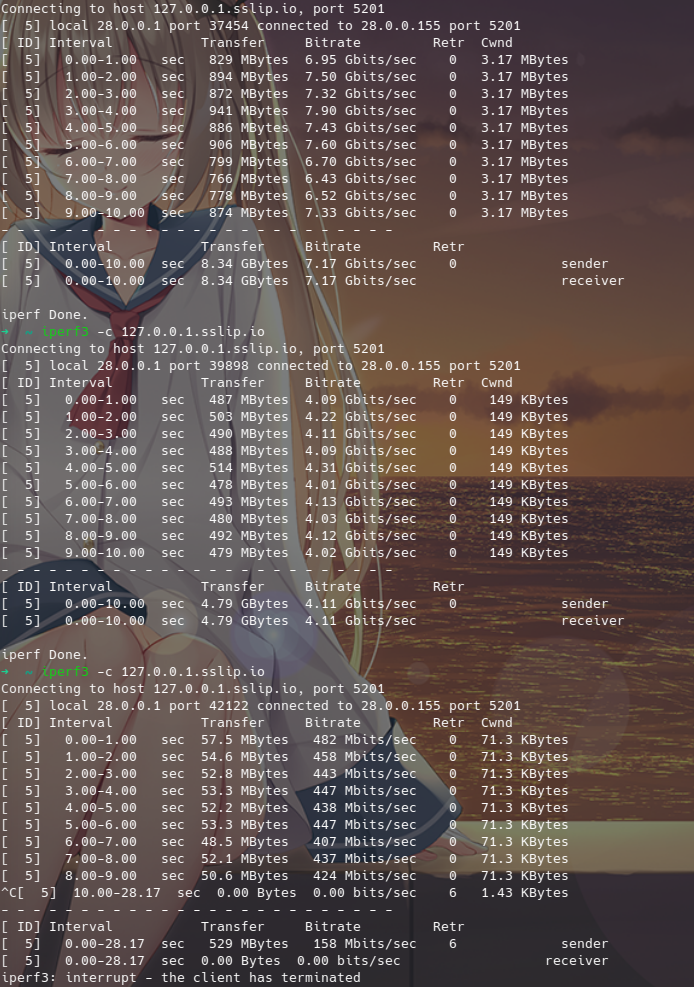

# TUN

```{.yaml linenums="1"}
tun:
  enable: true
  stack: system
  auto-route: true
  auto-detect-interface: true
  dns-hijack:
    - any:53
    - tcp://any:53
  device: utun0
  mtu: 9000
  strict-route: true
  gso: true
  gso-max-size: 65536
  udp-timeout: 300
  endpoint-independent-nat: false
  include-interface:
  - eth0
  exclude-interface:
  - eth1
  inet4-route-address:
  - 0.0.0.0/1
  - 128.0.0.0/1
  inet6-route-address:
  - "::/1"
  - "8000::/1"
  inet4-route-exclude-address:
  - 192.168.0.0/16
  inet6-route-exclude-address:
  - fc00::/7
  include-uid:
  - 0
  include-uid-range:
  - 1000:9999
  exclude-uid:
  - 1000
  exclude-uid-range:
  - 1000:9999
  include-android-user:
  - 0
  - 10
  include-package:
  - com.android.chrome
  exclude-package:
  - com.android.captiveportallogin
  table-index: 2022
```

## enable

启用 tun

## stack

tun 模式堆栈，如无使用问题，建议使用 `mixed`栈，默认 `gvisor`

可用值： `system/gvisor/mixed`

!!! note "协议栈之间的区别"
    * `system` 使用系统协议栈，可以提供更稳定/全面的 tun 体验，且占用相对其他堆栈更低
    * `gvisor` 通过在用户空间中实现网络协议栈，可以提供更高的安全性和隔离性，同时可以避免操作系统内核和用户空间之间的切换，从而在特定情况下具有更好的网络处理性能
    * `mixed` 混合堆栈，tcp 使用 `system`栈，udp 使用 `gvisor`栈，使用体验可能相对更好
    * [简单性能测试](tun.md#tun_1)

## device

指定 tun 网卡名称，MacOS 设备只能使用 utun 开头的网卡名

## auto-route

自动设置全局路由，可以自动将全局流量路由进入 tun 网卡。

## auto-detect-interface

自动选择流量出口接口，多出口网卡同时连接的设备建议手动指定出口网卡

## dns-hijack

dns 劫持，将匹配到的连接导入内部 [dns](../dns/index.md) 模块，不书写协议则为 udp://

!!! warning ""
    * 在 `MacOS`/`Windows` 无法自动劫持发往局域网的 dns 请求
    * 在 `Android` 如开启 `私人dns` 则无法自动劫持 dns 请求
    * 在 `Linux` 如果 `systemd-resolved` 开启则无法自动劫持 dns 请求

## strict-route

启用 `auto-route` 时执行严格的路由规则

*在 Linux 中*:

* 让不支持的网络无法到达
* 将所有连接路由到 tun

它可以防止地址泄漏，并使 DNS 劫持在 Android 上工作。

*在 Windows 中*:

* 添加防火墙规则以阻止 Windows
  的 [普通多宿主 DNS 解析行为](https://learn.microsoft.com/en-us/previous-versions/windows/it-pro/windows-server-2008-R2-and-2008/dd197552%28v%3Dws.10%29)
  造成的 DNS 泄露

它可能会使某些应用程序（如 VirtualBox）在某些情况下无法正常工作。

## mtu

最大传输单元，会影响极限状态下的速率，一般用户默认即可。

## gso

启用通用分段卸载，仅支持 Linux

## gso-max-size

数据块的最大长度

## udp-timeout

UDP NAT 过期时间，以秒为单位，默认为 300(5 分钟)

## endpoint-independent-nat

启用独立于端点的 NAT，性能可能会略有下降，所以不建议在不需要的时候开启。

## include-interface

限制被路由的接口，默认不限制，与 `exclude-interface` 冲突，不可一起配置

## exclude-interface

排除路由的接口，与 `include-interface` 冲突，不可一起配置

## inet4-route-address

启用 `auto-route`时路由自定义网段而不是默认路由，一般无需配置。

## inet6-route-address

启用 `auto-route`时路由自定义网段而不是默认路由，一般无需配置。

## inet4-route-exclude-address

启用 `auto-route` 时排除自定义网段

## inet6-route-exclude-address

启用 `auto-route` 时排除自定义网段

## include-uid

包含的用户，使其被 Tun 路由流量，未被配置的用户不会被 Tun 路由流量，默认不限制

!!! note ""
    UID 规则仅在 Linux 下被支持,并且需要 `auto-route`

## include-uid-range

包含的用户范围，使其被 Tun 路由流量，未被配置的用户不会被 Tun 路由流量

## exclude-uid

排除用户，使其避免被 Tun 路由流量

## exclude-uid-range

排除用户范围，使其避免被 Tun 路由流量

## include-android-user

包含的 Android 用户，使其被 Tun 路由流量，未被配置的用户不会被 Tun 路由流量

!!! note ""
    Android 用户和应用规则仅在 Android 下被支持,并且需要 `auto-route`

| 常用用户 | ID  |
| -------- | --- |
| 机主     | 0   |
| 手机分身 | 10  |
| 应用多开 | 999 |

## include-package

包含的 Android 应用包名，使其被 Tun 路由流量，未配置的应用包不会被 Tun 路由流量

## exclude-package

排除 Android 应用包名，使其避免被 Tun 路由流量

## file-descriptor

文件描述符

## table-index

创建路由表使用的编号

## Tun 的协议栈网络回环测试

从上到下分别为 `system/gvisor/lwip`,仅供参考，平台为 linux,Windows 和 MacOS 可能会有差异


